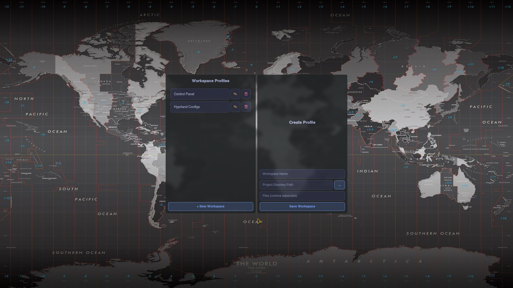

# Hyprland Workspace Profile Widget

VERSION [v0.1.0]

A lightweight, desktop overlay widget written in Python and PyQt6 designed specifically for Hyprland and Kitty terminal workflows. This tool eliminates the tedious process of manually reopening multiple project files, scripts, and terminal file managers when switching tasks. 

By defining project workspaces, a single click launches an isolated Kitty terminal instance configured with native, layout-accurate tabs mapping directly to your text editor (Micro) and your terminal file manager (Yazi).



## Features

- **Native Kitty Integration:** Leverages Kitty's high-performance remote control socket architecture to open files dynamically into clean, native tabs (`Ctrl+Shift+T`).
- **Hyprland Optimized:** Governed by explicit window rules to act as an elegant, borderless slider panel anchored to the edge of your display environment.
- **Resource Efficient:** Built with performance in mind, consuming near-zero CPU cycles on fanless hardware configurations.
- **Self-Contained Management:** Interactive creation, extraction, modification, and destruction panels directly from the widget layout—no manual JSON tracking required.
- **Smart Routing:** Automatically separates development scripts, shell environments, and configuration files from generic targets, opening text data directly in Micro and directory paths in Yazi.

## Prerequisites

The system layer relies on standard Linux package installations:

`sudo pacman -S python-pyqt6 kitty micro yazi` or your package manager.

## Installation

1. Enable Kitty Remote Control

Kitty must be configured to allow socket-based control operations. Open your configuration file:

`~/.config/kitty/kitty.conf`

Ensure the configuration includes these operational directives:

```zsh
allow_remote_control yes
listen_on unix:/tmp/kitty.sock
```

2. Install the Widget Script

Create a dedicated execution file inside your local path directory structure:

`~/.local/bin/hypr-workspace.py`

Paste the complete Python script code into this file, save it, and alter the system permissions to make it executable:

`chmod +x ~/.local/bin/hypr-workspace.py`

3. Add the Hyprland Window Rules and Keybindings

Example windowrule:

```zsh
hl.window_rule({
    name = "Workspaces Profiles",
    match = { title = "hypr-workspaces.py" },
    float = true,
    size = { 400, 520 },
    center = true,
    border_size = 0,
    animation = "fade",
    opacity = 0.8
})
```

Example keybind:

`hl.bind(altMod .. "+ SPACE", hl.dsp.exec_cmd("python3 ~/.local/bin/hypr-workspaces.py"))`

> *Note: Replace $mainMod with your designated modifier key (e.g., SUPER).*

## Usage & Workflow
Opening the Widget:

Pressing `Super + Space` initialises the borderless widget panel cleanly at the center or where ever you place it.

## Managing Workspace Layouts
- **Creating Profiles**: Click + New Workspace to slide open the creation form. Provide a project name, choose a workspace target directory (using the integrated directory selector pop-up via ...), and type a list of files separated strictly by commas without spaces (e.g., hyprland.lua,keybinds.lua,windowrules.lua). Click Save Workspace to commit the settings.
- **Modifying Profiles**: Hitting the edit symbol freezes the index target name, shifts the sidebar layout open, and populates the field parameters with your directory paths and active file trackers for rapid refinement.
- **Destroying Profiles (🗙)**: Clicking the red delete marker purges the index entry straight from the underlying configuration registry immediately.

## Launching Environment Targets
Clicking a workspace entry button triggers the execution sequence:

1. Spawns an isolated Kitty instance targeted at your project root.
2. Initialises a background command to execute your main script target directly.
3. Automatically maps subsequent file items into separate native workspace tabs running Micro, while setting the tab titles to match the corresponding files.

The widget closes itself automatically once the compilation pipeline dispatches, dropping your focus completely into the development layout context.

## File Extension Architecture
The tool identifies text, configuration files, and utility scripts using a native string matching array. The following extensions are automatically captured and routed directly into Micro text panes rather than directory layouts:

- **Shell Frameworks**: .py, .lua, .sh, .bash, .fish, .zsh, .awk, .sed
- **Configurations**: .conf, .json, .toml, .lock, .yaml, .yml, .ini, .theme, .rules
- **Documentation & Contexts**: .md, .txt
- **System Launchers**: .desktop, .service

All other unmapped indices default gracefully into native Yazi file manager panes.
> *NOTE: if you wish to add more to the list above, please open an issue on GitHub or message in the Discussions.*

## Storage Specifications
All workspace layout profiles are written automatically into a structured `JSON` configuration index file located at `~/.config/project-spaces.json`. This index file handles storage parameters transparently, ensuring consistency across terminal reboots.
